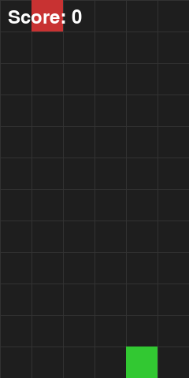
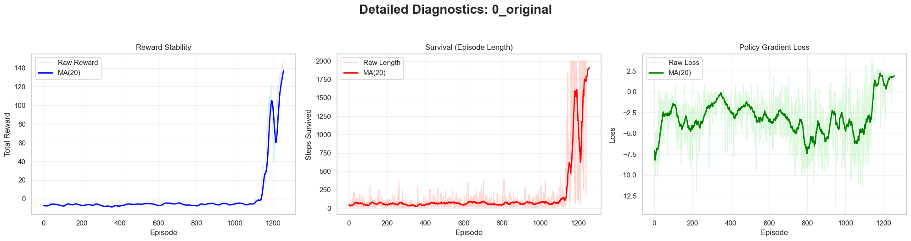
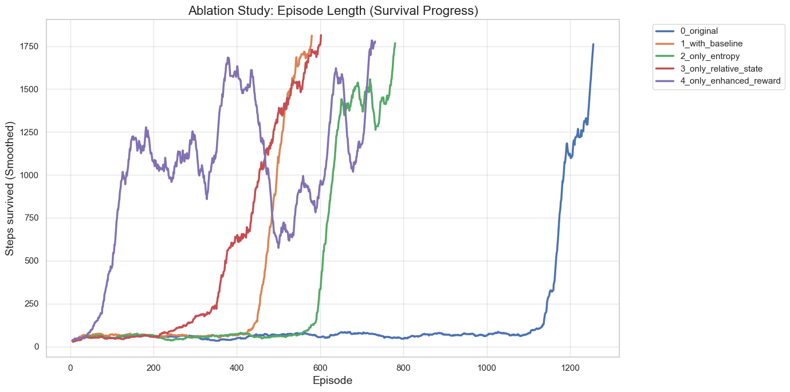
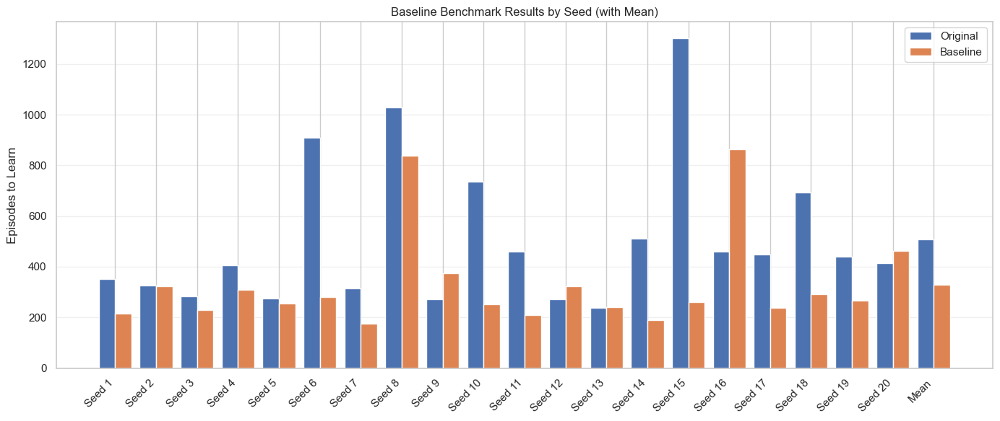

# Falling Blocks (REINFORCE)

This project implements a custom Reinforcement Learning environment where an agent must survive as long as possible by avoiding falling blocks in a 1D discrete grid.  
The agent is trained using the **REINFORCE policy gradient algorithm**.

<p align="center">
  
</p>

---

## Game Description

We consider a **one-dimensional discrete grid** of fixed width `W`. The agent is located at the bottom row and can move left or right to avoid falling blocks.

At each timestep, a block of some width falls down from the top of the grid. If the falling block reaches the agent level and overlaps the agent position, the episode ends.

The goal of the agent is to **survive as long as possible**.

---

## State Space

The environment state is represented as:

$$
s = (x_{agent}, x_{left}, x_{right}, y_{block})
$$

Where:

- $x_{agent}$ — agent position on the grid
- $x_{left}$ — left coordinate of the falling block
- $x_{right}$ — right coordinate of the falling block
- $y_{block}$ — vertical coordinate of the falling block

---

## Action Space

The agent has 3 discrete actions:

- `0` — move left
- `1` — stay
- `2` — move right

---

## Reward Function

Baseline reward scheme:

- **+1** if the block lands without hitting the agent
- **−10** if the block hits the agent (collision)

The episode terminates when collision happens.

---

## Training Algorithm (REINFORCE)

We train a stochastic policy $\pi_\theta(a|s)$ parameterized by a neural network.

For each episode we collect a trajectory:

$$
(s_0, a_0), (s_1, a_1), ..., (s_\tau, a_\tau)
$$

Discounted returns:

$$
G_t = \sum_{k=t}^{\tau-1} \gamma^{k} r_k
$$

REINFORCE objective:

$$
J(\theta) = \mathbb{E}\left[\sum_{t=0}^{\tau-1} G_t \log \pi_\theta(a_t|s_t)\right]
$$

Loss (minimized in practice):

$$
L(\theta) = -\sum_{t=0}^{\tau-1} G_t \log \pi_\theta(a_t|s_t)
$$


## Original REINFORCE Training Results




Let's evaluate our trained agent on 100 episodes. 

```bash
Evaluation Results:
  Episodes: 100
  Average Reward: 145.34
  Max Reward: 153.00
  Min Reward: 0.00
  Average Steps: 1909.6
```
The visualisation of the trained agent game you can see in the gif above, at the beginning of this README file.

---

## Training Improvements

During our experiments, we aimed to make training faster and more stable.  
As shown in the learning curves, the baseline REINFORCE setup produced noisy rewards and unstable episode lengths, which slowed down convergence.  
To reduce variance and accelerate learning, we tested several training improvements described below.

### 1) Height-Based Analytical Baseline (Approximate Value Function)

Firstly, we introduced an analytical baseline based on an approximate value function.

In our environment, rewards are sparse and occur only when the falling block reaches the bottom:

- Miss reward: `r_miss = +1` (the block lands without hitting the agent)
- Death reward: `r_death = -10` (the block hits the agent, episode ends)

There is no additional reward per step, meaning that the return is fully determined by survival events.

We approximate the full state:

$$
s = (agent_x, block_{left}, block_{right}, block_y)
$$

using only the block height:

$$
V(s) ≈ V(h), \:where \:h = block_y
$$

We also estimate the probability of surviving a landing event as a constant:

$$
p = p_{miss}
$$

where `p_miss` is computed empirically during training from previous episodes.

---

#### Analytical Derivation

If the block is currently at height `h`, the agent must survive `h` steps before reaching the landing event.
Since there are no rewards during falling, we obtain the discounted relation:

$$
V(h) = \gamma^h * V(0)
$$

At height `h = 0` (landing event):

- with probability `p`, the agent survives and receives `r_miss = +1`
- with probability `(1 - p)`, the agent dies and receives `r_death = -10`

If the agent survives, a new block spawns at height `H`, so the expected future return is `V(H)`.

Thus:

$$
V(0) = p * (r_{miss} + \gamma * V(H)) + (1 - p) * r_{death}
$$

Using:

$$
V(H) = \gamma^H * V(0)
$$

we get:

$$
V(0) = p * r_{miss} + (1 - p) * r_{death} + p * \gamma^{H+1} * V(0)
$$

Solving for `V(0)`:

$$
V(0) = \frac{p * r_{miss} + (1 - p) * r_{death}}{1 - p * \gamma^{H+1}}
$$

Substituting `r_miss = 1` and `r_death = -10`:

$$
V(0) = \frac{(11*p - 10)}{(1 - p * \gamma^{H+1})}
$$

Finally, for any height `h`:

$$
V(h) = \gamma^h * V(0)
$$

---

#### Using the Baseline in REINFORCE

We use this value estimate as a baseline in the policy gradient update:

$$
A_t = G_t - V(h_t)
$$

where:

- `G_t` is discounted return at timestep `t`
- `h_t` is the current block height

This baseline does not depend on the chosen action, so it preserves the correctness of the REINFORCE gradient while significantly reducing variance.

In practice, this led to faster convergence and smoother training curves.


### 2) Entropy Bonus (Encouraging Exploration)

A common failure mode of REINFORCE is **policy collapse**, when the agent becomes overconfident and starts selecting only one action.  
To prevent this, we add entropy regularization:

$$
H(\pi(\cdot|s_t)) = -\sum_a \pi(a|s_t)\log \pi(a|s_t)
$$

Final loss:

$$
L(\theta) = -\sum_{t} G_t \log \pi_\theta(a_t|s_t)
\:-\:
\beta \sum_t H(\pi_\theta(\cdot|s_t))
$$

Where $\beta$ is the entropy coefficient. This significantly improved exploration and prevented the agent from getting stuck.

### 3) Improved State Representation (Relative Coordinates)

The original state used absolute coordinates:

$$
(x_{agent}, x_{left}, x_{right}, y_{block})
$$

Learning from absolute positions was slow. We changed the state to relative distances:

$$
s = (d_{left}, d_{right}, y_{block})
$$

Where:

$$
d_{left} = x_{agent} - x_{left}, \quad
d_{right} = x_{right} - x_{agent}
$$

This makes the policy more position-invariant and improves learning speed.

### 4) Reward Shaping (Better Goal Signal)

Baseline reward:

- +1 for each successfully avoided block
- −10 for collision

Modified reward scheme:

- **+0.1** for each survived timestep
- **+10.0** for each successfully avoided block
- **−10.0** for collision

This provides a clearer training signal and improves learning speed.

---

## Comparison of Training Modifications




The comparison plot contains reward vs episode for:

- Original REINFORCE
- Baseline
- Entropy bonus
- Relative state representation
- Reward shaping


To ensure that the baseline improvement is not caused by a lucky random seed, we repeated the training procedure for 20 different seeds, comparing the original REINFORCE setup against the version with the analytical baseline. The results are shown in the figure below.



In the vast majority of runs, the baseline significantly accelerates convergence (fewer episodes are required to reach stable survival performance). On average, the baseline reduces the number of training episodes by approximately **30%**, confirming that the improvement is consistent and not due to randomness.


## Conclusion

In this project, we implemented a custom 1D Falling Blocks environment and successfully trained an agent using the REINFORCE policy gradient algorithm. While the original REINFORCE setup was able to learn a valid survival strategy, training was slow (515 episodes on average) and highly unstable due to the high variance of Monte-Carlo returns and sparse reward structure.

To address these issues, we introduced several improvements, including an analytical height-based baseline, entropy regularization, relative state representation, and reward shaping. These modifications significantly improved learning stability and accelerated convergence. In particular, the analytical baseline reduced training variance and provided a consistent performance gain across multiple random seeds, achieving approximately **30% faster learning on average**.

Overall, the experiments confirm that even simple variance-reduction techniques and better state/reward design can dramatically improve REINFORCE performance in sparse and stochastic environments.

## Development

### Running Tests

```bash
pytest tests/
```

### Code Structure

- **Agent**: `src/agent/reinforce_agent.py` - REINFORCE algorithm implementation
- **Environment**: `src/environment/game_env.py` - Game logic and state management
- **Training**: `src/training/trainer.py` - Training loop and optimization
- **Config**: `src/utils/config.py` - Configuration dataclasses

---

## Requirements

- Python 3.11+
- PyTorch 2.0+
- NumPy
- Pygame (for rendering)
- Pandas, Matplotlib (for analysis)
- Jupyter (for notebooks)
- Seaborn

## Installation

### Using Docker (Not Recommended)

```bash
# Build the Docker image
docker compose build

# Or using Makefile
make build
```

### Local Installation

```bash
pip install -r requirements.txt
```

## Quick Start

### Training Original REINFORCE

```bash
python run/train.py --name 0_original --state absolute --reward basic --episodes 10000 --seed 42
```

### Evaluation

```bash
python run/evaluate.py --checkpoint artifacts/ablation/0_original/checkpoints/best.pt --state absolute --reward basic --num_episodes 100
```

### Ablation Study

```bash
bash run_ablation.sh
```


### Baseline Stability Test 

```bash
bash run_20_seed.sh
```

## Docker Usage

### Build and Run

```bash
# Build image
docker compose build

# Run training
docker compose run --rm train

# Run evaluation
docker compose run --rm evaluate

# Start Jupyter Lab
docker compose up jupyter
# Access at http://localhost:8889 (or 8888 if port is available)
```

### Using Makefile

```bash
make build      # Build Docker image
make train      # Run training
make eval       # Run evaluation
make jupyter    # Start Jupyter Lab
make shell      # Interactive shell
```

## Project Structure

```
.
├── src/
│   ├── agent/           # REINFORCE agent implementation
│   ├── environment/      # Game environment and renderer
│   ├── training/        # Training loop and logger
│   └── utils/           # Configuration and utilities
├── run/                 # Training and evaluation scripts
├── artifacts/           # Checkpoints, logs, and statistics
├── analysis/            # Jupyter notebooks for analysis
└── tests/               # Unit tests
```

## Configuration

### Training Parameters

- `--name`: Experiment name
- `--norm`: Enable return normalization
- `--entropy`: Entropy coefficient for exploration
- `--state`: State representation mode (`absolute` or `relative`)
- `--reward`: Reward function mode (`basic` or `enhanced`)
- `--episodes`: Number of training episodes
- `--seed`: Random seed for reproducibility

### Environment Configuration

- Grid size: 6×12
- Block width: 1-2 cells
- Fall speed: 1 cell per step
- Action space: 3 actions (left, stay, right)

---

